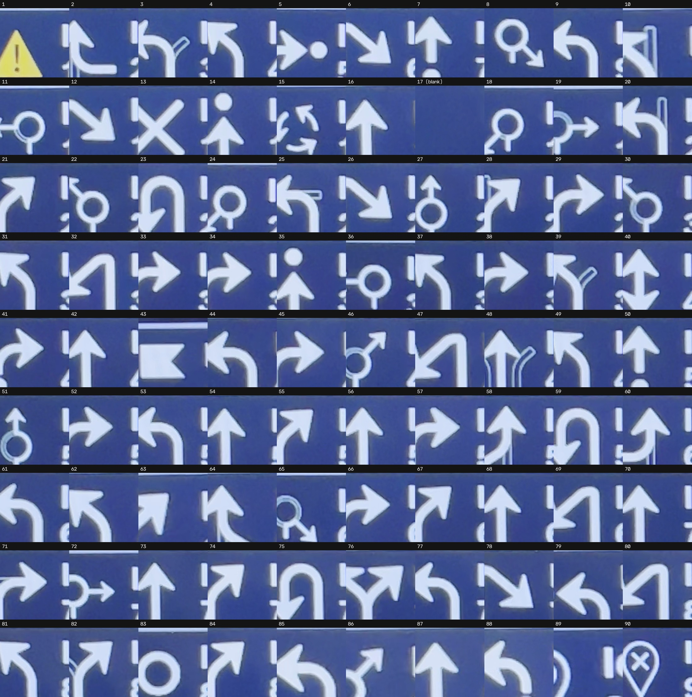
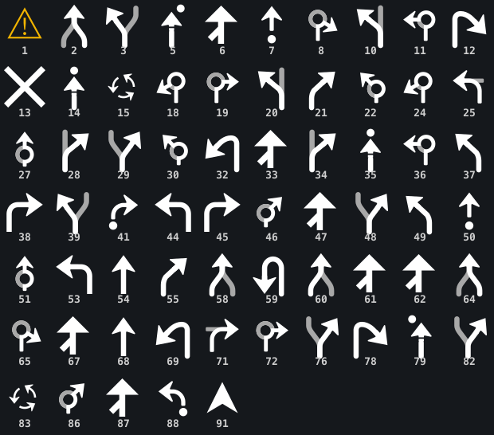

# Kiox icon IDs (`IconIdEnum`)

The numeric icon set the head unit can draw, from decompiled Flow
(`com.bosch.ebike.bes3.messagebus.IconIdEnumType`, 95 values, `0`–`94`).

**Where these are used:** the `ICON_IDS` field of a `FeatureStreamingAlert` (the interactive
alert/banner, field 5) and the `iconId` of a `ButtonContent` (field 2). See
[`NAV-PROTOCOL.md` §3a/§3c](NAV-PROTOCOL.md) for the alert schema and the turn-by-turn use.

**Color is baked into the icon.** You don't set a color — you pick an icon, and the firmware draws it
in its fixed color (e.g. `WARNING_ICON` renders as a **yellow** triangle). Text has no color field, so
color on screen comes only from the chosen icon (and, on the cert-gated map, `LayerStyle`).

**Not every id renders on every head unit.** When the display can't draw an id it returns
`ICON_ERROR` in the alert response (see §3b) — a self-reporting support check. Confirmed on a **Kiox 300**:

| id | name | Kiox 300 |
|---|---|---|
| 1 | `WARNING_ICON` | ✅ renders (yellow triangle) |
| 89 | `LOCATOR_ICON` | ✅ renders |
| 91 | `NAVIGATION_ICON` | ❌ `ICON_ERROR` |

The rest are untested per-device; treat the response as the oracle. Machine-readable list:
[`data/icon_ids.csv`](../data/icon_ids.csv). Names are verbatim from Bosch, including their typos
(`NOTIFICAITON` at 45 and 78) — the **number** is what goes on the wire.

## The glyphs

### The real Kiox 300 glyphs (captured)

*The **actual head-unit artwork** — captured by sweeping every icon id onto a Kiox 300 and filming the
screen, then cropping one frame per id. **ids 1–90** (0 is a placeholder; **91–94 don't render** on the
300 — `NAVIGATION`/`RECENT_SEARCH`/`MUSIC`/`KOMOOT` return `ICON_ERROR`). **id 17 is genuinely blank on
the Kiox** (confirmed on hardware — the head unit draws nothing for it), which is why that cell is empty.
Each cell is centred on the glyph's own pixels, so the thin white edge visible in some cells is the
panel's left border, not a cropping slip. This is what the Kiox really draws — note how it differs from
the Mapbox stand-ins below (e.g. id 5 curves the arrow **into** the dot).*

### Mapbox vector stand-ins (clean, for reference)

*Clean vector **stand-ins** (Mapbox artwork) — same maneuver per id, different drawing. Useful where the
photo above is rough, and covers the maneuver taxonomy tidily. Scalable source:
[`kiox-icon-map.svg`](images/kiox-icon-map.svg).*

**Provenance — this is a maneuver *key*, not a picture of the Kiox's glyphs.** The Kiox draws each
icon from its **own firmware icon set**, which is *not* in the APK (Flow just sends the id *number*
and the head unit draws it). The glyphs here are Flow's bundled **Mapbox Navigation SDK** drawables
(`res/drawable/mapbox_ic_*.xml`, decompiled Android-vector → SVG), mapped to `IconIdEnum` by maneuver
name (`1` `WARNING` = Flow's `ic_alert_warning`). **Confirmed on hardware (Kiox 300):** the id ↔
maneuver mapping is correct (a photographed id 2 is a merge, 5 is an arrive-right, etc.), but the
**drawings differ** — e.g. id 5 `ARRIVE_RIGHT` curves the arrow *into* the dot on the Kiox vs a
straight arrow here. Use this to look up **which maneuver an id is**, not what it looks like pixel-for-pixel.

**Colors are applied by the head unit.** These are **monochrome template icons** (drawn `#000000`,
tinted at runtime), so the sheet is rendered the way the Kiox actually shows them: **white on a dark
background**, with the **secondary road in gray** (`#a8a8a8` — the real `mapbox_turn_icon_shadow_color`,
so a merge/fork shows *your* route white and the *other* road gray) and **`WARNING` (1) in yellow**
(confirmed on hardware). The exact per-icon color for every id is a firmware choice not fully encoded
in the APK; what's faithful here is the geometry and the route-vs-secondary two-tone.

**88 of 95 shown.** `CONTINUE_*`, `NEW_NAME_*`, and `INVALID_*` have **no distinct Mapbox glyph** — Mapbox
(and the Kiox) reuse the matching *turn* arrow, so those ids are drawn here with the turn glyph as a proxy
(e.g. `continue left` = the `turn left` arrow; that's how ids like `4` `INVALID_SLIGHT_LEFT` and `16`
`INVALID_STRAIGHT` appear).

**The 7 ids *not* pictured** (the gaps in the sheet's numbering — every other id 1–94 is present):

| id | name | why absent |
|---|---|---|
| 0 | `ICON1` | the enum's zero/default slot — a placeholder, not a real maneuver icon |
| 17 | `MERGE_STRAIGHT` | Mapbox ships merge left/right/slight-left/slight-right but **no** `merge_straight` drawable |
| 40 | `UPDOWN` | no Mapbox drawable (unusual maneuver) |
| 43 | `FLAG` | no Mapbox drawable (overlaps `ARRIVE` = 35) |
| 90 | `NO_GPS` | status/UI icon, outside the Mapbox nav set — no drawable found in the APK |
| 92 | `RECENT_SEARCH` | " |
| 93 | `MUSIC` | " |

These are absent from the **Mapbox stand-in** because the source drawable isn't in Flow's APK — *not* because
the Kiox lacks them. The captured sheet above proves it: the Kiox **does** draw `40` (up/down arrow), `43`
(flag), and `89`/`90` (location pins). (`17` `MERGE_STRAIGHT` renders **blank on the Kiox itself** — confirmed on hardware; `0` and `91`–`94` don't render.)

## Getting the *real* Kiox glyphs — open (help wanted)

**Status:** the real Kiox 300 glyphs (**ids 1–90**) are now captured — see
[The real Kiox 300 glyphs](#the-real-kiox-300-glyphs-captured) above. The Kiox's firmware bitmaps are
**not in the Flow APK** (Flow only sends the id *number*), so a screen capture like that — or one of the
routes below — is the only way to the true artwork. Still open, and **help welcome**:

- a **cleaner / pixel-perfect** capture (the handheld video clips a few cells and id 17 landed blank),
- the **other head units** — Kiox 500, Nyon, Purion (and the 300 on other firmware),
- and either route below.

**A. Screenshot / film each icon — *done for the 300*.** Sweep every id onto the screen via a
`FeatureStreamingAlert` (each labeled "Icon N") and film it; crop a frame per id. That's how the sheet
above was made. The **clean *digital*** version would be the head unit's own **`DEBUG_TAKE_SCREENSHOT`**
(`8D-82` / `A2-80`) — but note it's a `CallableDataPoint<ScreenshotConfig, UInt>` that returns only a
*handle*, with the image coming back over the separate **`UPLOAD_RESOURCE`** channel, and it reads
`not-available` over **BLE**. The **wired diagnostic channel is less restricted** (it's how USB-only fields
like pack voltage are read), so it may answer there. *Help wanted:* anyone with a **wired diagnostic link**
(e.g. `bes3-reader`) who can try `8D-82` → `UPLOAD_RESOURCE` for pixel-perfect captures.

**B. Extract the Kiox firmware image and carve the bitmaps.** Flow's FOTA layer stores a direct **`downloadUrl`**
(plus `fileHash`, `fileSizeBytes`, `pki`) for each component's firmware in a local SQLite DB
(`UpdateSetInfoDatabase`, table `UpdateSetSoftware`), and Flow **does not decrypt** the image — it relays it
to the bike as-is, so the downloaded file is exactly what the bike flashes. Given the image, the icon/font
bank can be carved and rendered. *Caveats:* the URL only appears **when an update is actually offered** (a Kiox
on older firmware, or the next Bosch push), reading the DB needs a **rooted phone**, and the image is
**signed** (`pki`) and **may be encrypted** — though asset regions (icons/fonts) are often left in the clear.
*Help wanted:* a captured **Kiox firmware update `.bin`** (any version — the icons rarely change).

The **Kiox 300 is now covered** (ids 1–90, above). Help is most wanted for **other head units**, a
**cleaner capture**, and route B for **pixel-perfect** bitmaps — please open an issue if you can help.

## Status / UI icons

| id | name | glyph |
|---|---|---|
| 0 | `ICON1` | enum default / placeholder |
| 1 | `WARNING_ICON` | yellow warning triangle |
| 89 | `LOCATOR_ICON` | location pin |
| 90 | `NO_GPS_ICON` | no-GPS |
| 91 | `NAVIGATION_ICON` | navigation arrow/compass |
| 92 | `RECENT_SEARCH_ICON` | recent search |
| 93 | `MUSIC_ICON` | music note |
| 94 | `KOMOOT_ICON` | Komoot logo |

## Maneuver arrows (`DIRECTION_*`)

Mapbox-style `type × modifier`. Cell = icon id; `·` = no such variant. The straight column is the
"through" arrow; *base* is the modifier-less icon for that type.

| type | sharp&nbsp;L | left | slight&nbsp;L | straight | slight&nbsp;R | right | sharp&nbsp;R | base | u-turn |
|---|---|---|---|---|---|---|---|---|---|
| **turn**        | 69 | 44 | 37 | 68 | 55 | 38 | 12 | ·  | ·  |
| **continue**    | ·  | 9  | 31 | 70 | 74 | 66 | ·  | 73 | 75 |
| **depart**      | ·  | 88 | ·  | 7  | ·  | 41 | ·  | 50 | ·  |
| **arrive**      | ·  | 79 | ·  | 14 | ·  | 5  | ·  | 35 | ·  |
| **merge**       | ·  | 2  | 64 | 17 | 58 | 60 | ·  | ·  | ·  |
| **fork**        | ·  | 3  | 39 | 48 | 82 | 29 | ·  | 76 | ·  |
| **roundabout**  | 24 | 36 | 22 | 27 | 86 | 72 | 8  | 83 | ·  |
| **rotary**      | 18 | 11 | 30 | 51 | 46 | 19 | 65 | 15 | ·  |
| **on-ramp**     | 47 | 61 | 62 | 87 | 67 | 33 | 6  | ·  | ·  |
| **off-ramp**    | ·  | 20 | 10 | ·  | 28 | 34 | ·  | ·  | ·  |
| **end-of-road** | ·  | 25 | ·  | ·  | ·  | 71 | ·  | ·  | ·  |
| **new-name**    | 80 | 85 | 81 | 56 | 84 | 57 | 26 | ·  | ·  |
| **notification**| 32 | 53 | 49 | 54 | 21 | 45 | 78 | ·  | ·  |
| **invalid**     | ·  | 77 | 4  | 16 | 63 | 52 | ·  | 42 | 23 |

Standalone (no modifier): **u-turn** `59` · **close** `13` · **flag** `43` · **up/down** `40`.

### Common turn-by-turn subset

For basic guidance, the `turn` row plus a few extras cover most cases:

| maneuver | id | | maneuver | id |
|---|---|---|---|---|
| turn left | 44 | | u-turn | 59 |
| turn right | 38 | | arrive / flag | 35 / 43 |
| straight (turn) | 68 | | depart | 50 |
| continue | 73 | | roundabout | 83 |
| slight left / right | 37 / 55 | | fork left / right | 3 / 29 |
| sharp left / right | 69 / 12 | | keep left / right (fork slight) | 39 / 82 |
