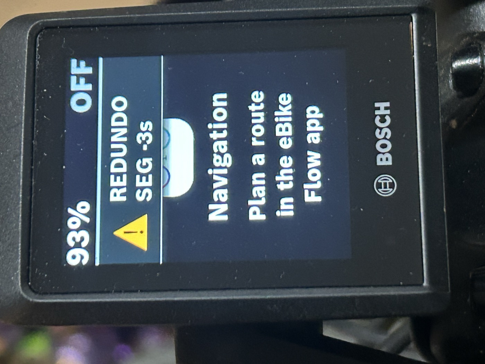
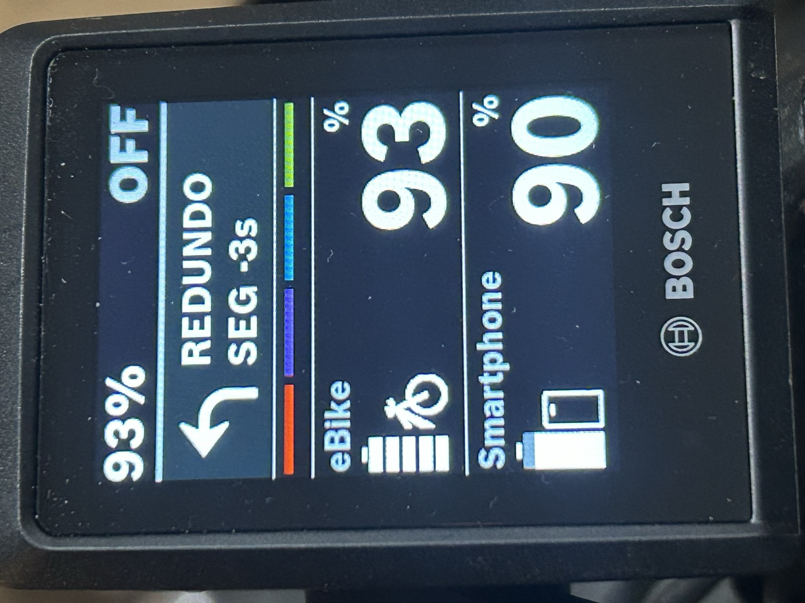
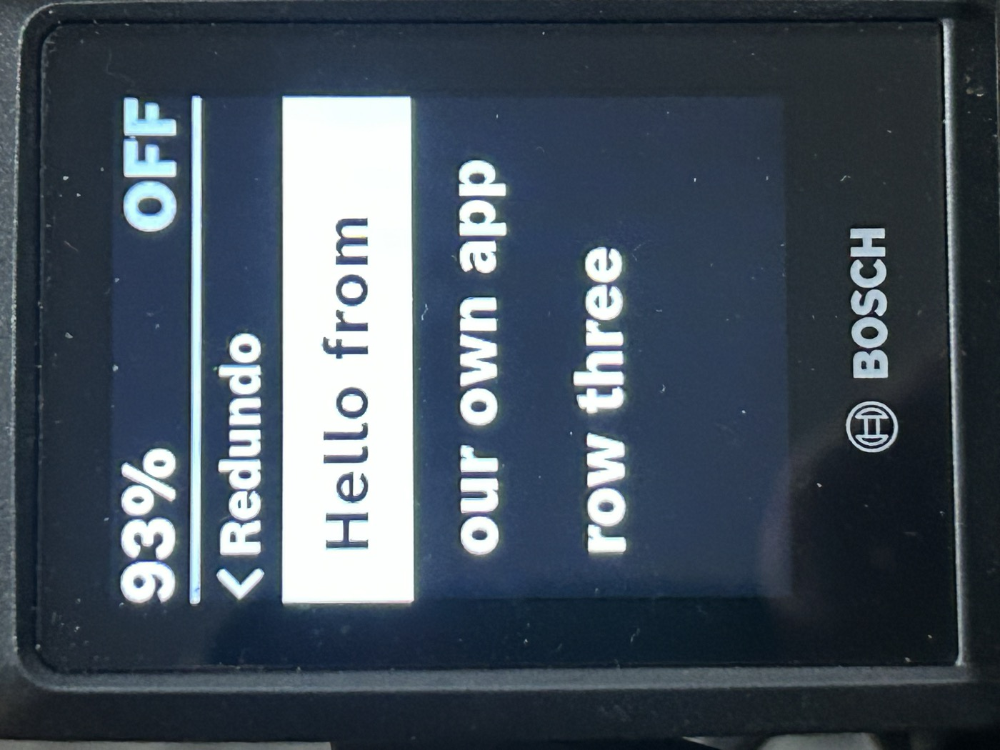

# The Bosch navigation / feature-streaming protocol — reference

*Companion to [FINDINGS.md §6](FINDINGS.md) (the narrative). This is the precise, implement-from
reference for the **command channel** and the **navigation map-tile system** — the counterpart to
[DECODER-CARD.md](DECODER-CARD.md) (telemetry fields) and [BLE-ACCESS.md](BLE-ACCESS.md) (request
grammar), for the nav side.*

**By redundo.app.** One bike, deeply verified — a Smart System (gen 4) Performance Line CX with a
**Kiox 300** display — cross-checked byte-for-byte against a real Bosch Flow → Kiox HCI capture and
against Flow's own decompiled encoder (`com.bosch.ebike.onebikeapp`, class `TileConversionKt`).

> **Confidence tags** (same as FINDINGS): **VERIFIED** = closed against a capture, hardware, or
> Flow's own code · **STRONG** = consistent across ≥2 captures · **PLAUSIBLE** = decoded but not
> independently confirmed · **NEGATIVE** = tested and ruled out.

---

## 1. Transport

The navigation traffic rides the **same undocumented diagnostic characteristic** as telemetry:
`0x0011` (notify, drive-unit → phone) and `0x0012` (write, phone → drive-unit, ATT handle `0x0021`),
under the vendor service tree (base `…-eaa2-11e9-81b4-2a2ae2dbcce4`). Everything below is one or more
**length-prefixed `0x30` frames** packed into an ATT write or notification — split on the `0x30`
boundary first (`30 <len> <body>`), then interpret each body by its first bytes.

There are **two body shapes** on this channel:

| Body shape | Direction | Meaning |
|---|---|---|
| `<idHi> <idLo> <protobuf>` | phone → bike | **provider frame** — the phone *hosts* a component (id high-bit set, `0xC0…`) and pushes its value |
| `40 80 <idHi> <idLo> <typeSeq> <arg>` | phone → bike | **RPC / action frame** — call a method on a bike component (`typeSeq` high nibble = 4) |
| `<idHi> <idLo> <typeSeq> <val>` | bike → phone | **reply** — id high-bit *clear* (`0x0D…`), see §2 |

`typeSeq` = `(type << 4) | seq`: type nibble `4` = RPC call, and `seq` (0…F) is a rolling counter the
reply echoes (+0x10).

---

## 2. RPC replies — accept vs reject **(VERIFIED)**

Every `40 80 <id> <typeSeq>` write draws a reply frame on `0x0011`. The shape tells you the outcome:

| Reply | Meaning |
|---|---|
| `<idLo-of-response> c0 80 <seq> 10 <v>` | **accepted / recognized.** `v = 1` = applied to a live/visible target; `v = 0` = accepted but not currently displayed |
| `<id> 40 80 <seq> 08` | **rejected / malformed** — the bike couldn't parse or apply it |

Example (our authored tile, accepted): `30 07 0d 2b c0 80 51 10 00` → id `0D2B` (= `8D2B` with the
component bit cleared), accepted, value `0` (not displayed). Flow's live-map tiles return `10 01`.

---

## 3. Navigation provider fields — the turn card **(VERIFIED on hardware)**

The phone hosts the **MobileApp component `0xC0…`** and feeds the Kiox nav card by pushing these
provider fields. A lone push often won't render; Flow streams the whole set at ~1 Hz.

| Field | Name | Payload | Notes |
|---|---|---|---|
| `C0-A1` | NAVIGATION_ADVICE | `{1:{1:maneuver, 2:distStr, 3:unitStr}}` | the turn card (icon + distance) |
| `C0-97` | distance-to-destination | varint (feet) | drives the countdown |
| `C0-99` | time-to-destination | varint (seconds) | |
| `C0-9A` | sequence | varint | monotonic tick |
| `C0-82` | status banner | `FeatureStreamingAlert` — `{1:{08 <id> 10 <tmpl> 22 <text> 2A 01 <icon> 40 <timeout>}}` | **confirmed rendered** ("HELLO"); full schema (template/icon/2-line/buttons/timeout) in **§3a** |
| `C0-A8` | speed / quality | `{1:speed, 2:quality}` | field 1 speed r≈0.91 vs GPS |
| `C0-A4` | rider name | string | |
| `C0-85` | altitude | varint | |

**Maneuver codes** (`C0-A1` field 1), validated against two rides with known turns + GPX bearings:

| Code | Maneuver |
|---|---|
| `38` | continue straight |
| `44` | turn left |
| `68` | turn right (sharp / immediate) |
| `73` | turn right (normal) |

> `C0-82` status text renders anytime (it's the "Route started / Off route / Arrived" path). The
> turn card (`C0-A1`) and the map only render inside an **active navigation session** — see §7.

### 3a. The `C0-82` banner is a full `FeatureStreamingAlert` — **(SOURCE-VERIFIED from Flow)**

Decompiled Flow (`NavigationBhuBanner.show()` → `FeatureStreamingAlert.newBuilder()…`) shows the
`C0-82` payload we replay is **not** a fixed 12-char status line — it is the `FeatureStreamingAlert`
protobuf. Field numbers and the enum catalogs come straight from the generated classes
(`com.bosch.ebike.bes3.messagebus.FeatureStreamingAlert` + `AlertTemplateEnumType` / `IconIdEnumType`),
so the earlier "single style, text only" reading is superseded. This replaces the planned blind
field1/field2 hardware sweep — the fields are named, not guessed.

Payload `{1:{ 08 <id> 10 <tmpl> 22 <longStr> 2A 01 <icon> 40 <timeout> }}` decodes as:

| # | Field | Type | Meaning | What our `navStatus` hard-codes |
|---|---|---|---|---|
| 1 | `ALERT_ID` | int | id to correlate show/hide + the response | `1` |
| 2 | `ALERT_TEMPLATE` | enum | layout: `DEFAULT`=0, `CENTERED`=1, `DEFAULT_PLUS_HORIZONTAL_ICON`=2, `BANNER_ICON_LEFT`=3 | `3` (never varied) |
| 3 | `SHORT_STRINGS` | repeated string | short-form text | *(unused)* |
| 4 | `LONG_STRINGS` | repeated string | **body text — Flow passes `firstTwoLinesOf(str)`, i.e. up to 2 lines** | one line |
| 5 | `ICON_IDS` | repeated enum | icon(s); **95-value `IconIdEnum`** — `89`=`LOCATOR_ICON`, plus every turn arrow, `NAVIGATION_ICON`(91), `NO_GPS_ICON`(90), `MUSIC_ICON`(93)… | `89` (never varied) |
| 6 | `PRIMARY_BUTTON` | `ButtonContent{1:text, 2:iconId}` | a labeled button | *(unused)* |
| 7 | `SECONDARY_BUTTON` | `ButtonContent{1:text, 2:iconId}` | a second labeled button | *(unused)* |
| 8 | `TIMEOUT` | int (s) | display seconds; **`0` = hide** (Flow's hide path is `setAlertId(id).setTimeout(0)`) | `5` |

The `.setTimeout(5)` → wire `40 05` match is the anchor that pins the whole mapping.

**It is interactive.** The bike replies `FeatureStreamingAlertResponse{1:alertId, 2:responseType}`
with `responseType ∈ { PRIMARY_BUTTON_PRESSED, SECONDARY_BUTTON_PRESSED, TIMEOUT }` — so a two-button
alert reports the rider's choice back to the phone over the same channel.

**Interactive — the bike answers on a sibling address.** The response is a bike→phone write to
`MobileAppAddresses.FEATURE_STREAMING_ALERT_RESPONSE` (raw **0x4083**, sub-id **0x83**), observed framed as
`0D 00 C0 83 <seq> 08 <alertId> 10 <responseType>`. The menu/option sibling is
`FEATURE_STREAMING_OPTION_RESPONSE` (raw **0x4084**, sub-id **0x84**) carrying `OptionResponse{1:optionGroupId, 2:optionId}`.

### 3b. Kiox 300 hardware results — **(VERIFIED on hardware, one CX + Kiox 300)**

First on-device run of the full `FeatureStreamingAlert` (alertId 7, template 3 = `BANNER_ICON_LEFT`,
two-line `LONG_STRINGS` "REDUNDO\nSEG -3s", icon **91 = `NAVIGATION_ICON`**, a `PRIMARY_BUTTON`, timeout 8):

| Sent | Bike reply (`0x83`) | Reading |
|---|---|---|
| template 3 + 2-line text + icon 91 + button | `responseType = 5` (`ICON_ERROR`) — **every** send | template **accepted**, text **accepted** (incl. two lines), **icon 91 rejected** |

- **No `TEMPLATE_ERROR`, no `TEXT_ERROR`** → the 300 accepts template 3 and multi-line text. An `ICON_ERROR`
  appears to reject the whole alert (nothing rendered), so a valid icon is required.
- **Confirmed with a valid icon:** re-sent with `WARNING_ICON = 1` → response `TIMEOUT` (displayed, then auto-dismissed)
  and it **rendered**: a yellow yield/warning triangle (icon-left) + two lines "REDUNDO"/"SEG -3s". So **icons 1
  (`WARNING`) and 89 (`LOCATOR`) render; 91 (`NAVIGATION`) → `ICON_ERROR`** — the icon-support subset is the thing to map.
- **Sound = negative, conclusive:** a fully-rendered alert produced no beep → the Kiox 300 has no buzzer (not a
  permission gate; consistent with `PLAY_SOUND` `NO_ROUTE` and `BUZZER` `DENIED`).
- **Interactive menu-pick confirmed:** selecting the highlighted row returned `OptionResponse{optionGroupId, optionId}`
  (optionId 0 is protobuf-omitted = first row) on sub-id `0x84`.
- The **response decode is the oracle**: no photographs needed to tell accepted from rejected — the bike says so.



*The alert rendered with `WARNING_ICON` (icon 1): a yellow triangle on the left (template 3 `BANNER_ICON_LEFT`) + two lines of text.*

**Where each surface renders.** The alert is an overlay that appears on the current screen — **confirmed on ALL
screens** (not just nav), so it is a true any-screen coaching/notification surface. The option-group text page is
nav-screen-only and sits behind the "hold 2 s" entry gate → a deliberate scrollable/selectable list.

### 3c. Turn-by-turn navigation via the alert — **no cert, any screen (VERIFIED on hardware)**

**The alert's `ICON_IDS` is the full Mapbox maneuver-arrow set**, and those arrows render on the Kiox 300 (many
`DIRECTION_*` icons tried, all displayed). This **routes around the cert wall** (§8): the C0-A1 turn card + map
tiles need a route object + Bosch-signed authorization, but a turn *instruction* is just
`alert{ icon = maneuver arrow, LONG_STRINGS = "Turn left\nMain St", timeout }` — no route object, no OEM auth,
and it shows on every screen. So a third-party app can drive real turn-by-turn guidance on the Kiox without the map.



*A turn arrow + text rendered by the alert on the **battery data screen** — not the nav screen — so turn-by-turn guidance shows on any screen, with no route object and no cert.*

Maneuver → `IconIdEnum` value (core subset; taxonomy is Mapbox `type × modifier`, Flow pulls Mapbox tiles):

| Maneuver | icon | Maneuver | icon |
|---|---|---|---|
| turn left | 44 | slight left | 37 |
| turn right | 38 | slight right | 55 |
| straight / continue | 68 / 73 / 70 | sharp left | 69 |
| u-turn | 59 | sharp right | 12 |
| arrive / flag | 35 / 43 | fork left / right | 3 / 29 |
| depart | 50 | keep left / right (fork slight) | 39 / 82 |
| roundabout | 83 | end of road left / right | 25 / 71 |

(Full set also has merge, on-ramp, off-ramp, rotary, new-name L/R/slight/sharp variants — 87 `DIRECTION_*`
maneuver icons, 95 icon ids total incl. status/UI. **Complete map: [`KIOX-ICONS.md`](KIOX-ICONS.md)** / [`data/icon_ids.csv`](../data/icon_ids.csv).)
This is a **separate, simpler channel** from the C0-A1 turn card (§3): the alert needs no route object and renders
anywhere; C0-A1 needs an active route + the nav screen. For custom nav, prefer the alert.

**Scroll-select menu renders our content (separate finding).** The option-group / Text-PAGE path
(§4–5) displayed our own list on the 300 — title "‹ Redundo" + rows "Hello from / our own app / row three"
with the first row highlighted as the selection cursor — **not** the previously-seen Flow destination cache.
That is the native "scroll to an item, press to select" UI driven by `UiControlCommandEnum` (`UP`/`DOWN`/`CONFIRM`),
with the pick returned as `OptionResponse` on sub-id `0x84`. Capturing that `0x84` response on an actual
select is the remaining step to close the scroll-select loop.



*Our own option-group text page on the 300 — title "‹ Redundo" + our rows, first row highlighted as the selection cursor.*

---

## 4. The feature-streaming tile system

The map is drawn by a generic **feature-streaming** framework. Relevant message ids (`8D` = HeadUnit
component):

| id | Name | Role |
|---|---|---|
| `8D-23` | FEATURE_STREAMING_TILES_OF_INTEREST | **bike → phone**: which tile slots it wants filled |
| `8D-24` | FEATURE_STREAMING_TILE | a streaming tile |
| `8D-26` | FEATURE_STREAMING_OPTION_GROUP | declare a feature / menu (e.g. "Navigation" + destinations) |
| `8D-2B` | **SET_TILE_CONTENT** | **phone → bike**: the map vector data |
| `8D-2F` | FEATURE_STREAMING_OPTION_STRIPE | option stripe |
| `8D-00` | (via provider `40-9B`) | elevation profile (packed varint curve) |

It is **pull-based**: the bike advertises tiles of interest (`8D-23`), and only accepts `8D-2B`
content for slots it has asked for.

---

## 5. The tile data model **(VERIFIED — capture + Flow's `TileConversionKt`)**

A `SET_TILE_CONTENT` arg is a protobuf. Field numbers are positional (kotlinx-serialization ProtoBuf):

```
SetTileContent { 1: TilePosition[]        // enumeration / position frames use field 1
                 2: TileContent }          // content frames use field 2
TilePosition   { 1: slot                   // 1..8 local slot index
                 2: AbsolutePoint }         // omitted in the "enumeration" frame, present in "position" frame
AbsolutePoint  { 1: x, 2: y }              // global tile coords × 160 — see §6
TileContent    { 1: tileIndex(=slot)
                 2: Layer[] }
Layer          { 1: styleIndex             // reference into the style table; omitted ⇒ 0
                 2: Shape[] }
Shape          { 1: RelativePoint[] }      // ≤22 pts; longer polylines chunk with a 1-pt overlap
RelativePoint  { 1: x, 2: y }              // ABSOLUTE 0..159 px within the tile; a 0 coordinate is OMITTED
```

**Encoder gotcha (VERIFIED):** content addresses the tile under `SetTileContent.field 2`, so a
content arg is `pbLen(2, pbLen(2, TileContent))` — **two** field-2 wrappers. The enumeration and
position frames use `field 1` (one wrapper). Omitting the inner content wrapper produces a silent
`…08` reject.

### Style table

Sent **once** at feature start (a `SET_TILE_CONTENT` whose payload is `field 4`), it's a list of
`LayerStyle { 1: colorARGB(int32), 2: lineWidth(byte) }`. Layers reference it by index. The table
captured from Flow:

| idx | color (ARGB) | width | use |
|---|---|---|---|
| 0 | `#FFFFFFFF` white | 10 | **route** (TRAIL layer — in trail-nav the trail *is* your route) |
| 1 | grey | 6 | roads |
| 2 | `#FF0000FF` blue | 3 | water |
| 3 | — | 5 | (buildings) |
| 4 | — | 5 | (land use) |

---

## 6. Coordinate system — the keystone **(VERIFIED vs GPX, ratio 1.0000)**

`AbsolutePoint` is a **standard Web-Mercator (OSM slippy-map) tile coordinate at zoom 18, times 160.**
Verified by matching the ride's GPX centre to the captured `AbsolutePoint`/160 at a ratio of 1.0000.

```
tileX = (lon + 180) / 360 · 2^18
tileY = (1 − ln(tan(lat) + sec(lat)) / π) / 2 · 2^18
AbsolutePoint = ( round(tileX) · 160 , round(tileY) · 160 )    # per-tile placement

# a road vertex's local pixel inside its tile:
localX = frac(tileX) · 160        # 0..159
localY = frac(tileY) · 160        # 0..159   (y increases downward; rider sits bottom-centre)
```

A tile is `160 × 160` px. The Kiox 300 (`240 × 320`) displays roughly **one** tile and pre-loads a
`3 × 3` ring (a `480 × 480` sheet) around it so the map can scroll. Adjacent tiles differ by exactly
1 tile-index (160 in `AbsolutePoint` units).

---

## 7. The session handshake **(VERIFIED — captured, byte-exact)**

To display a feature the phone must register as its source, then stream content for the slots the
bike requests. Captured opening sequence (each frame verified against the capture):

```
> 30 05 41 80 8d 23 60                         subscribe to 8D-23 (tiles of interest), source 0x4180
> 30 4d 40 80 8d 26 20 <option-group>          8D-26 OPTION_GROUP  ("Navigation" + destinations)
> 30 08 40 80 8d 2f 20 0a 01 01                 8D-2F option stripe
> 30 05 40 80 8d 23 02                          confirm tiles of interest
< …8d23 0a <n> <tile-ids…>                      bike advertises the slots it wants
> …8d2b 40 <style-table>                        style table (§5)
> …8d2b <seq> <enumeration>                     declare slots 1..8 (positions empty)
> …8d2b <seq> <position-table>                  slots → AbsolutePoints (§6)
> …8d2b <seq> <content per slot>                the map (§5)
```

An authored set built this way (our own Mercator math, our own bytes) is **structurally accepted by
the bike — reply `c0 80 … 10 00`, zero rejects.**

---

## 8. The wall — live rendering is cryptographically gated **(NEGATIVE, by design)**

Accepted tiles come back **not-displayed** (`10 00` vs Flow's `10 01`): they render only on a live
**map canvas**, and the Kiox opens one only inside an **authenticated navigation session**.
Selecting a destination triggers a **certificate exchange** — BER-TLV `7F21` cert with `5F24/5F25`
validity, `5F34` sequence, `5F37` signature — a Bosch-CA-signed credential, mutually verified (the
head unit stores a `RemoteControl.publicKeyType`; the bus carries a dedicated `bes3 Signature`
message).

> **Correction (2026-08-16): `DISPLAY_GENERIC_TEXT` is *not* blocked by this gate.** An earlier
> version of this section said the certificate was "the same gate that denies `8D-4A`". It isn't.
> `8D-4A` — along with `8D-24`, `8D-25` and `8D-82` `DEBUG_TAKE_SCREENSHOT` — is refused by the
> **static address filter the gateway applies before routing** (see
> [`BLE-ACCESS.md`](BLE-ACCESS.md#two-stages-policy-first-then-routing)), which is a different and
> more absolute wall: it is **verb-independent** (`READ`, `SUBSCRIBE` and `RPC` all return
> `DENIED`) and it applies even to addresses on components the bike does not have. No session,
> credential or argument reaches those addresses. The certificate gate below governs the **map
> canvas** specifically — authored tiles are accepted (`10 00`) and simply never rendered.
>
> The distinction matters: option-group text **does** render with no credential at all (see §7 and
> `sendTextPage`), so "third parties cannot put text on the Kiox" was too strong. What they cannot
> do is use `8D-4A`, and cannot open a map canvas.

Decompiling Flow confirms the credential is **not extractable**: its `securestore` holds key material
in the **Android hardware Keystore** (`KeyGenParameterSpec` / TEE-StrongBox) — the code uses the
private key but never contains it — and the trust root is **Bosch's CA**, so a self-signed keypair is
rejected. Authorization is deliberately engineered to be non-forgeable.

**Net:** the protocol is fully understood and reproducible up to the security boundary. You can build
the exact bytes of your own map and turns; you cannot make the display show them without Bosch's
cryptographic authorization. This document does not attempt to break that boundary.

---

## 9. Worked example — author one tile

```python
Z = 18
def tile_xy(lat, lon):
    import math; n = 2**Z
    x = (lon + 180) / 360 * n
    y = (1 - math.log(math.tan(math.radians(lat)) + 1/math.cos(math.radians(lat))) / math.pi) / 2 * n
    return x, y

# 1. pick a centre → its tile + AbsolutePoint   (example: central London)
cx, cy = tile_xy(51.50700, -0.12800)
ctx, cty = int(cx), int(cy)
abs_point = (ctx * 160, cty * 160)                    # → position table entry for the centre slot

# 2. a road from two real points → local pixels in that tile
def local(lat, lon):
    x, y = tile_xy(lat, lon)
    return (min(159, max(0, int((x - ctx) * 160))),
            min(159, max(0, int((y - cty) * 160))))
road = [local(51.506819, -0.128832), local(51.506338, -0.127974)]   # e.g. (30,40)→(130,130)

# 3. emit: style table (§5) → enumeration → position(slot→abs_point) → content(slot, layers)
#    content layer 0 (style omitted) = white route; layer with styleIndex 1 = grey road
#    wrap content as SetTileContent.field2 (see §5 gotcha)
```

---

*Source protocol map + verification: **redundo.app**. Capture method (HCI snoop / iPhone
PacketLogger) and cross-generation context: see [FINDINGS.md](FINDINGS.md) §8 and
[CREDITS.md](../CREDITS.md). Nav-tile format cross-checked against Flow's decompiled `TileConversionKt`.*
